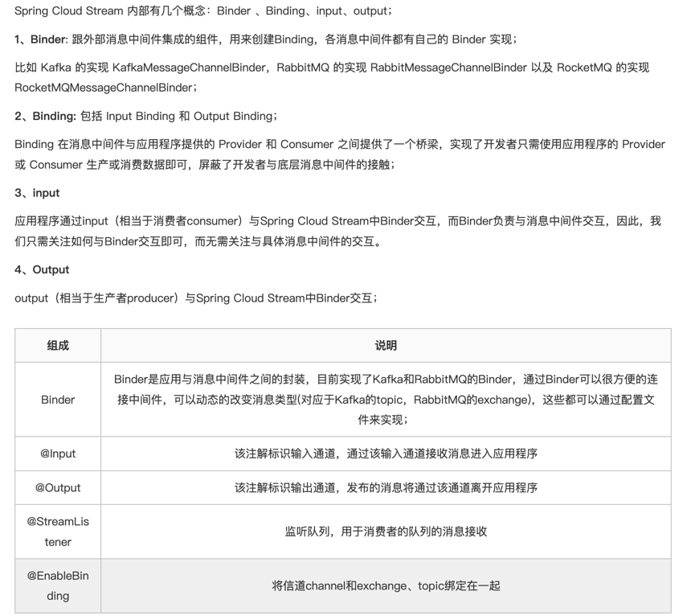

[](https://github.com/candysevenZzz/spring-cloud-alibaba-demo/network/dependencies)
[](https://github.com/candysevenZzz/spring-cloud-alibaba-demo/README.md)
[](https://github.com/candysevenZzz/spring-cloud-alibaba-demo)
[](https://www.apache.org/licenses/LICENSE-2.0.html)

# spring-cloud-alibaba 练习项目

---
### 已整合功能清单：
* **spring-cloud-gateway 网关**

  已实现功能:
  - 引入``Sa-Token``实现**网关统一鉴权**。详见[官方文档](https://sa-token.cc/doc.html#/micro/gateway-auth) 。
  - 引``sentinel``作为流控组件。详见[官方文档](https://github.com/alibaba/Sentinel/blob/master/README.md) 。
  - 增加了路由匹配规则，简化访问路由
  

* **spring-cloud-openfeign** 基于http的RPC客户端 
   
  支持：
  - 通过注册中心服务发现实现远程调用 
  - 指定url地址，直接请求服务 
  - 动态url地址，直接请求服务


* **spring-cloud-starter-alibaba-nacos-discovery** 服务发现注册组件 
  

* **spring-cloud-starter-alibaba-nacos-config** nacos配置中心组件


* **[spring-cloud-alibaba-demo-mq-starter](https://github.com/candysevenZzz/spring-cloud-alibaba-demo)** 自定义rocketmq starter 实现生产者+消费者组件
  

* **spring-cloud-starter-stream-rocketmq** stream rocketmq组件
  
  

--- 
### 模块说明
````
spring-cloud-alibaba-demo
├── README_zh.md
├── pom.xml
├── spring-cloud-alibaba-auth  登录鉴权
├── spring-cloud-alibaba-common 公用模块
├── spring-cloud-alibaba-gateway 网关
├── spring-cloud-alibaba-order 订单模块
├── spring-cloud-alibaba-mq mq消息模块
└── spring-cloud-alibaba-user 用户模块
````
